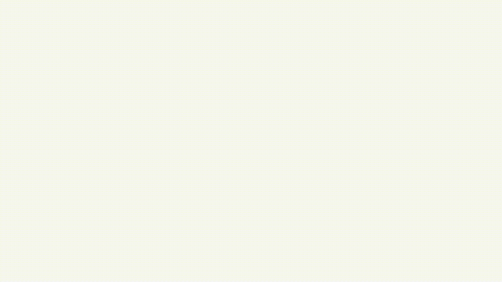
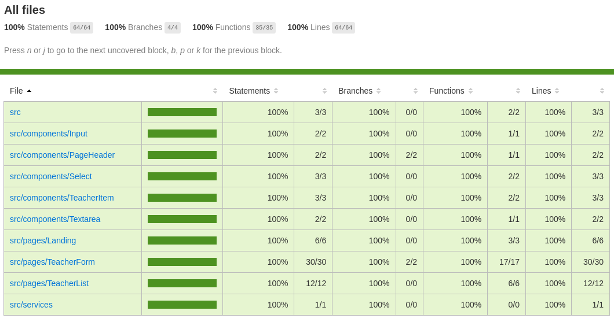

# Agilizei Bootcamp - Challenge 3

The challenge is to complement the tests made on the Level 3 of the bootcamp, which we improve our understanding about component, API and UI testing. We also see how to use [Cypress Dashboard.](https://dashboard.cypress.io/projects/sbbzcn/runs/2/overview)

The testing application is Proffy, an app where teachers can offer classes at affordable prices, and students can hire then. 

It was made during one of the Next Level Week, an event made by Rocketseat, and the pages tested are:

- Landing page;
- Register teacher;
- Search teacher.

## Videos/Screenshots

### Landing page

### Register teacher page

### Search teacher page

### Code coverage

## How to run

Clone the repository:

`git clone https://github.com/gmcotta/agilizei-desafio3.git`

Access the server folder and install the dependencies:

`cd server && npm install` or `cd server && yarn`

Access the web folder and install the dependencies:

`cd ../web && npm install` or `cd ../web && yarn`

On the web folder, start the server and the app:
`npm run start:ci` or `yarn start:ci`

If you want to start the app with source code instrumented:
`npm run start:ci:inst` or `yarn start:ci:inst`

To open Cypress:
`npm run cy:open` or `yarn cy:open`

To open Cypress for component testing:
`npm run cy:open-ct` or `yarn cy:open-ct`

To run the API tests:
`npm run test:api` or `yarn test:api`

To run the UI tests:
`npm run test:ui` or `yarn test:ui`

To run the component tests
`npm run test:component` or `yarn test:component`

To run API and UI tests:
`npm run test:all` or `yarn test:all`

To check code coverage, open `coverage/index.html`
